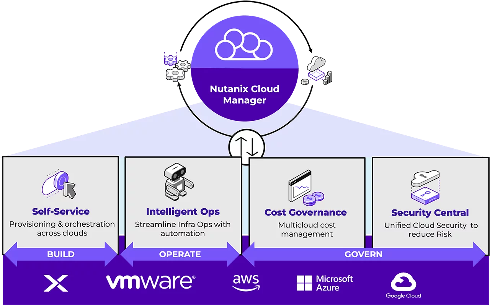

# Nutanix Cloud Manager

> Nutanix Cloud Manager (NCM) helps organizations easily build and manage multicloud deployments by automating routine tasks and providing tools for orchestration and security compliance

🌐 [nutanix.com/products/cloud-manager](https://www.nutanix.com/products/cloud-manager)

<!--
Intelligent Operations
Self-Service
Cost Governance
Security Central
-->

## High-level

## Components

### Self-Service

> NCM Self-Service (formerly Calm) streamlines how teams manage, deploy and scale applications across hybrid clouds with self-service, automation and centralized role-based governance

🌐 [nutanix.com/products/cloud-manager/self-service](https://www.nutanix.com/products/cloud-manager/self-service)

<!-- [Workshops](https://nutanix-technologybootcamp.readthedocs.io/en/latest/what_is_calm/what_is_calm.html) -->
